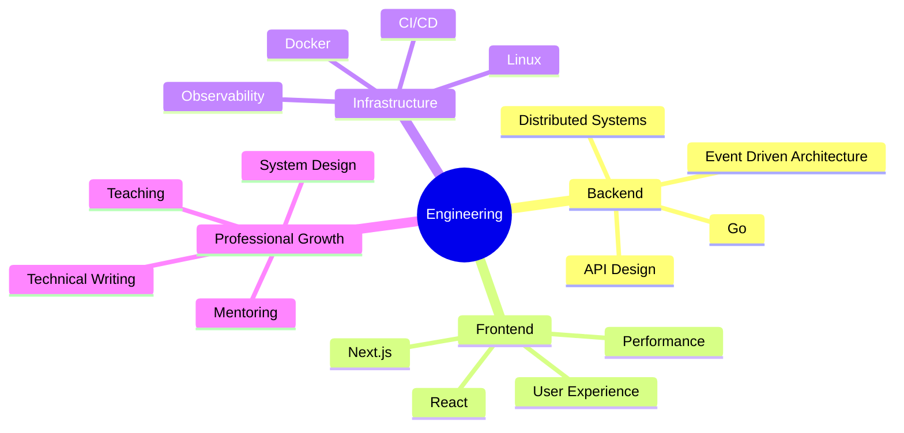

<!-- ========================= -->
<!--       PROFILE HEADER      -->
<!-- ========================= -->

<div align="center">


<br />

<h1>
  Hi there, I'm Huy Hoang
  
</h1>

<h3>Full-stack Software Engineer · Lecturer · Technology Enthusiast</h3>

<p>
  
</p>

<p>
  <a href="mailto:nguyenthehuyhoang2002@gmail.com">
    
  </a>
  <a href="https://github.com/HuyHoangDevVN">
    
  </a>
  <a href="https://www.facebook.com/huyhoang.nguyenthe.90">
    
  </a>
</p>

<p>
  
  
</p>

</div>

---

<!-- ========================= -->
<!--         ABOUT ME          -->
<!-- ========================= -->

## `~/about-me`

```typescript
type Developer = {
  name: string;
  roles: string[];
  experience: string;
  location: string;
  interests: string[];
  philosophy: string;
};

const huyHoang: Developer = {
  name: "Nguyen The Huy Hoang",

  roles: [
    "Full-stack Software Engineer",
    "Lecturer",
  ],

  experience: "2+ years",
  location: "Vietnam",

  interests: [
    "Modern web development",
    "Backend engineering",
    "System architecture",
    "DevOps and infrastructure",
    "Developer experience",
    "Technology education",
  ],

  philosophy: "Build clearly. Learn continuously. Share generously.",
};
```

I am a **Full-stack Software Engineer with more than two years of hands-on experience** in software development.

I currently work as a **lecturer at Dai Nam University**, where I combine practical software engineering experience with teaching, mentoring and knowledge sharing.

I enjoy turning ideas and requirements into software that is:

- Reliable in real-world environments
- Maintainable as the codebase grows
- Clear enough for teams to understand
- Practical for the people who use it
- Designed with performance and security in mind

---

<!-- ========================= -->
<!--       QUICK PROFILE       -->
<!-- ========================= -->

## `~/quick-profile`

| | |
|---|---|
| **Current role** | Full-stack Software Engineer and Lecturer |
| **Experience** | More than two years |
| **Main language** | TypeScript |
| **Primary focus** | Full-stack development and backend engineering |
| **Interested in** | Architecture, infrastructure and developer experience |
| **Currently exploring** | Go, distributed systems and cloud-native engineering |
| **Working style** | Practical, systematic and outcome-oriented |
| **Favorite principle** | Simplicity is a feature |

---

<!-- ========================= -->
<!--        TECH STACK         -->
<!-- ========================= -->

## `~/technology-stack`

<div align="center">

### Languages


<br />

### Frontend and Mobile


<br />

### Backend


<br />

### Data and Messaging


<br />

### DevOps and Development Tools


</div>

---

<!-- ========================= -->
<!--         TOOLBOX           -->
<!-- ========================= -->

## `~/daily-toolbox`

<p align="center">


</p>

---

<!-- ========================= -->
<!--       CURRENT FOCUS       -->
<!-- ========================= -->

## `~/current-focus`

```text
01  Building clean and maintainable full-stack applications

02  Improving backend architecture and API design

03  Learning more about Go and distributed systems

04  Strengthening DevOps and infrastructure knowledge

05  Improving software performance and reliability

06  Sharing practical engineering knowledge with students
```

---

<!-- ========================= -->
<!--      ENGINEERING STYLE    -->
<!-- ========================= -->

## `~/how-i-build`

<table>
  <tr>
    <td width="50%" valign="top">
      <h3>01. Understand First</h3>
      <p>
        I try to understand the real problem, constraints and expected
        outcomes before selecting technologies or designing solutions.
      </p>
    </td>
    <td width="50%" valign="top">
      <h3>02. Keep It Clear</h3>
      <p>
        I prefer readable code, explicit responsibilities and architecture
        that developers can understand without unnecessary complexity.
      </p>
    </td>
  </tr>
  <tr>
    <td width="50%" valign="top">
      <h3>03. Build for Reality</h3>
      <p>
        Software should handle errors, unexpected inputs and operational
        challenges instead of working only in ideal development conditions.
      </p>
    </td>
    <td width="50%" valign="top">
      <h3>04. Improve Continuously</h3>
      <p>
        I treat feedback, incidents and technical challenges as opportunities
        to improve both the system and my engineering approach.
      </p>
    </td>
  </tr>
</table>

---

<!-- ========================= -->
<!--   ENGINEERING PRINCIPLES  -->
<!-- ========================= -->

## `~/engineering-principles`

```yaml
engineering:
  problem_solving:
    - Understand the problem before choosing the technology
    - Separate actual requirements from unnecessary complexity
    - Prefer practical solutions over impressive-looking solutions

  code_quality:
    - Write code that other developers can understand
    - Keep modules focused and responsibilities explicit
    - Refactor when complexity begins to slow the team down

  reliability:
    - Expect failures and handle them intentionally
    - Treat security as part of the product
    - Measure performance instead of relying on assumptions

  collaboration:
    - Communicate decisions clearly
    - Document important knowledge
    - Share what I learn with the team and community

  growth:
    - Stay curious
    - Learn from real-world challenges
    - Improve one iteration at a time
```

---

<!-- ========================= -->
<!--       WHAT I VALUE        -->
<!-- ========================= -->

## `~/what-i-value`

> **Good software is not only software that works.**  
> It should also be understandable, maintainable, reliable and valuable to its users.

| Value | What it means to me |
|---|---|
| **Clarity** | Code and decisions should be easy to explain |
| **Reliability** | Systems should behave predictably under real conditions |
| **Simplicity** | Complexity should be justified, not celebrated |
| **Ownership** | Developers should care about outcomes, not only assigned tasks |
| **Learning** | Every challenge should improve the next implementation |
| **Sharing** | Knowledge becomes more valuable when it helps other people |

---

<!-- ========================= -->
<!--      LEARNING RADAR       -->
<!-- ========================= -->

## `~/learning-radar`



---

<!-- ========================= -->
<!--       GITHUB ACTIVITY     -->
<!-- ========================= -->

## `~/github-activity`

<div align="center">


</div>

> The activity graph reflects public GitHub activity only.  
> Private and organization-owned contributions may not be fully represented.

---

<!-- ========================= -->
<!--       BEYOND THE CODE     -->
<!-- ========================= -->

## `~/beyond-the-code`

```bash
$ whoami
Software engineer by profession
Lecturer by responsibility
Problem solver by mindset
Lifelong learner by choice

$ interests
technology
teaching
system-design
developer-experience
continuous-improvement

$ status
always-learning
```

Besides software development, I enjoy teaching, mentoring and helping students connect academic concepts with practical engineering.

Teaching encourages me to explain complicated ideas more clearly, question assumptions and continuously strengthen my own technical foundations.

---

<!-- ========================= -->
<!--        FUN SECTION        -->
<!-- ========================= -->

## `~/developer-mode`

```javascript
while (true) {
  understand();
  design();
  build();
  test();
  improve();
  share();
}
```

<details>
  <summary><strong>A few things about how I work</strong></summary>

<br />

- I prefer fixing root causes instead of repeatedly patching symptoms.
- I like converting large problems into clear and verifiable steps.
- I enjoy improving both engineering quality and user experience.
- I believe documentation is part of implementation.
- I am comfortable learning unfamiliar technologies when the problem requires them.
- I value complete, testable and maintainable outcomes.

</details>

---

<!-- ========================= -->
<!--          CONTACT          -->
<!-- ========================= -->

## `~/connect`

<div align="center">

<p>
  Open to meaningful conversations about software engineering,
  technology education and professional growth.
</p>

<a href="mailto:nguyenthehuyhoang2002@gmail.com">
  
</a>

<a href="https://github.com/HuyHoangDevVN">
  
</a>

<a href="https://www.facebook.com/huyhoang.nguyenthe.90">
  
</a>

<br />
<br />


</div>

---

<!-- ========================= -->
<!--          FOOTER           -->
<!-- ========================= -->

<div align="center">

### Build thoughtfully · Learn continuously · Deliver reliably

<sub>
  Thanks for visiting my profile. Have a great day!
</sub>

<br />
<br />


</div>
